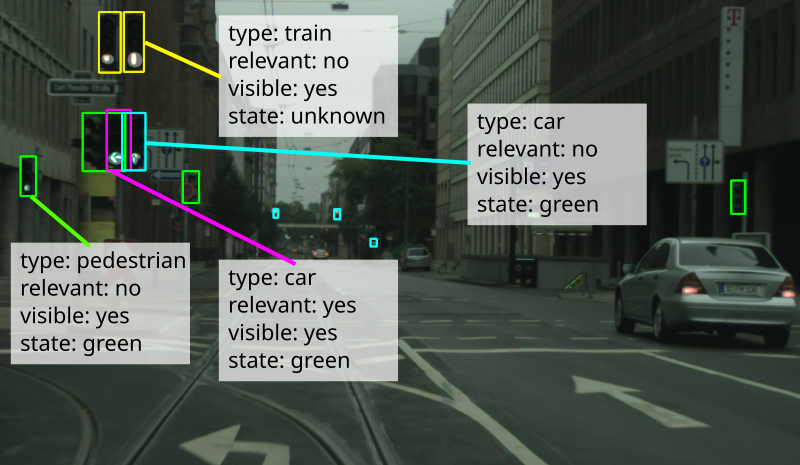

# Semantic traffic lights for the Cityscapes dataset



Semantically annotated traffic lights for the [Cityscapes dataset](https://www.cityscapes-dataset.com/). 

## Usage

Run the `apply_changes.py` script on top of your dataset copy (setting the `--dry-run`-flag will not modify anything):

```
python3 apply_changeset.py /path/to/cityscapes ~/Downloads/changes_dusseldorf.json
```

marginalize labels for a single-class object detector:

Adapt `my_marginalization` in `marginalize.py` to your liking. Then run

```
python3 marginalize.py /path/to/updated/cityscapes /tmp/my/marginalized/labels
```
